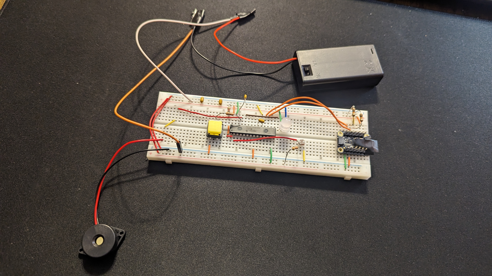

# Backpack Anti-Theft Device

## Purpose
Don't want to haul your backpack with you when you use the restroom while at a library? Want a device that can protect your backpack while you temporarily leave it in a public area? The Backpack Anti-Theft Device has your back! The device is designed to detect if your backpack is stolen or opened while you are gone. The device uses an accelerometer to detect acceleration of the backpack, and a light sensor to determine if the backpack is opened. An alarm is used to warn others in the area that your backpack is being stolen if theft is detected. A PIC24FJ64GA002 microcontroller was used to program the device.

## Basic Usage
To turn the device on/off, press the button on the device. A Neopixel will blink green indicating that the device is turned on and will blink red when turned off. Once turned on, the owner has several seconds to place the device in the backpack before the device begins to detect theft. Once theft is detected, the device will wait four seconds before activating the alarm to prevent false alarms when the owner returns to the backpack and is about to turn off the device.

## Contributors
Sharmarke Ahmed, Ryan Fowler

# Prerequisites

## Required Components
x1 [PIC24FJ64GA002 Microcontroller](https://www.microchip.com/en-us/product/pic24fj64ga002)

x1 [Adafruit LIS3DH Accelerometer](https://www.adafruit.com/product/2809?gad_source=1&gclid=CjwKCAiAyp-sBhBSEiwAWWzTng758qFh1ccZYN-W3IYm0OJq4i9Z773qQTu2pqHoFSRisHBWtLSJjRoCa5QQAvD_BwE)

x1 [3kΩ-11kΩ Photoresistor](https://www.jameco.com/z/CDS001-8001-Jameco-ValuePro-Photocell-CdS-3-11K-Ohm-at-10lux-200K-at-0lux-100mW-150V_202403.html)

x1 [Neopixel](https://www.digikey.com/en/products/detail/sparkfun-electronics/COM-12986/5673799?utm_adgroup=&utm_source=google&utm_medium=cpc&utm_campaign=PMax%20Shopping_Product_Medium%20ROAS%20Categories&utm_term=&utm_content=&utm_id=go_cmp-20223376311_adg-_ad-__dev-c_ext-_prd-5673799_sig-CjwKCAiAyp-sBhBSEiwAWWzTnoZ-XQZx-TUwZwcwp1yn48JGT_trn6JN0JjBlwL91_PW0Zx3a_brgBoCnxAQAvD_BwE&gad_source=1&gclid=CjwKCAiAyp-sBhBSEiwAWWzTnoZ-XQZx-TUwZwcwp1yn48JGT_trn6JN0JjBlwL91_PW0Zx3a_brgBoCnxAQAvD_BwE)

x1 [PushButton](https://www.mouser.com/ProductDetail/SparkFun/COM-09190?qs=WyAARYrbSnYmfgv9mXV0oQ%3D%3D&mgh=1&gad_source=1&gclid=CjwKCAiAyp-sBhBSEiwAWWzTnofFgdtUWDP15f3rVGnVzY4zecxDPyJE231fVN6-uZd9ur5HnXz8WRoCOWAQAvD_BwE) (other buttons may work as well)

x1 [Piezoelectric Buzzer](https://www.digikey.com/en/products/detail/mallory-sonalert-products-inc./PK-26N04W-03VQ/5033696?utm_adgroup=&utm_source=google&utm_medium=cpc&utm_campaign=PMax%20Shopping_Product_Low%20ROAS%20Categories&utm_term=&utm_content=&utm_id=go_cmp-20243063506_adg-_ad-__dev-c_ext-_prd-5033696_sig-CjwKCAiAyp-sBhBSEiwAWWzTnjxWujHa4Asg7b3j2BlYIs90I1teDHXC8uVnKdqJyJu5TyBC-4aQiBoCYEAQAvD_BwE&gad_source=1&gclid=CjwKCAiAyp-sBhBSEiwAWWzTnjxWujHa4Asg7b3j2BlYIs90I1teDHXC8uVnKdqJyJu5TyBC-4aQiBoCYEAQAvD_BwE) (Any buzzer may be used as long as it works with 3V)

x3 10kΩ resistors

x2 100Ω resistors

x1 4.7kΩ resistor

x2 0.1µF capacitors

x2 10µF capacitor

x2 AA Batteries

x1 2 Cell AA Battery Pack

Additionally, when implementing this device for the first time, the [MPLAB® SNAP Debugger](https://www.microchip.com/en-us/development-tool/pg164100) is necessary to program the PIC24FJ64GA002 with the necessary software. 

## Required Software
The following software is necessary to program the PIC24FJ64GA002 with the source code.
[MPLAB® X IDE | Microchip Technology](https://www.microchip.com/en-us/tools-resources/develop/mplab-x-ide)
[MPLAB® XC16 Compiler | Microchip Technology](https://www.microchip.com/en-us/tools-resources/develop/mplab-xc-compilers/xc16)

# Implementation

## Circuit Schematic

Note: the internal pull up resistor shown in the schematic is enabled via software and should not be connected via hardware.

## Steps to Program Microcontroller

1. Connect the MPLAB X SNAP debugger to the circuit. Refer to [MPLAB Snap User's Guide](https://ww1.microchip.com/downloads/en/DeviceDoc/50002787C.pdf), p. 11 and page 2 of the [PIC24 Family Reference Manual](https://ww1.microchip.com/downloads/aemDocuments/documents/OTH/ProductDocuments/DataSheets/39881e.pdf) for specific directions on how to connect the MPLAB Snap to the microcontroller.
2. Open the MPLAB X IDE. Click on File -> New Project. Select Microchip embedded category, standalone project. Select PIC24FJ64GA002 as the device for the project. Ensure the project is set as main project.
3. On GitHub, navigate to the Backpack-Anti-Theft-Device.X folder and download all of the files in the directory. Move these files to the directory in which your project is stored on your local computer.
4. Right click on Source Files --> Add Existing Items. Select all of the .c files and the Neopixel_asmLib.s files to include them in the folder. Similarly, right click on Header Files --> Add Existing Items. Select all of the .h files to include them in the folder.
5. Select "Make and Program Device Main Target" to program the PIC24JF64GA002 with the recently imported source code.

# Additional Information
For more information about how the specific libraries function, a .pdf file for each library documenting how to use the various public functions for each library is included in the documentation folder of this repository. A powerpoint presentation in the documentation folder also goes in depth into how the device works.
